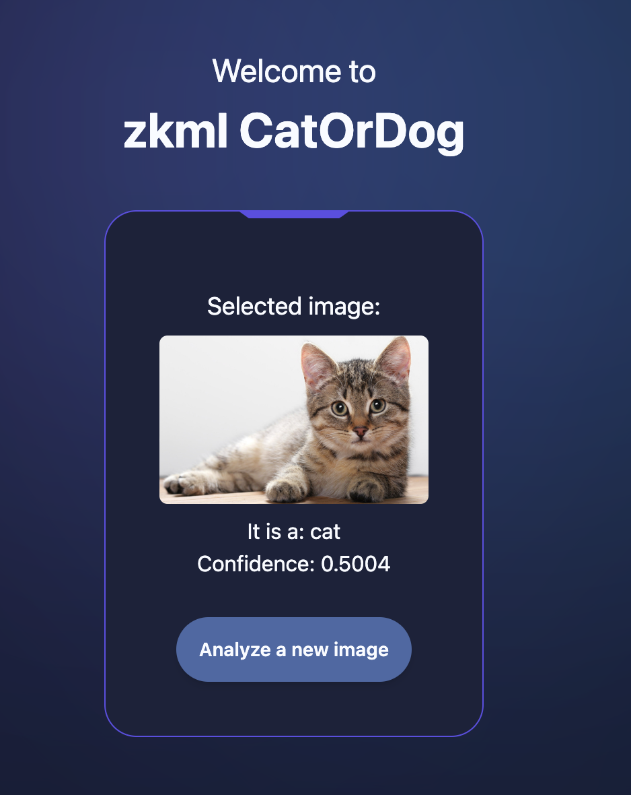

# ZKML Cat or Dog

## Architecture

## Flow 

## Demo

    

## Stack
- ezkl
- microservices (FastAPI)
- Frontend scaffold-stark (React + NestJS)

## Team

- Javier Montes
- Chris Cushman
- Cristian Chaparro
