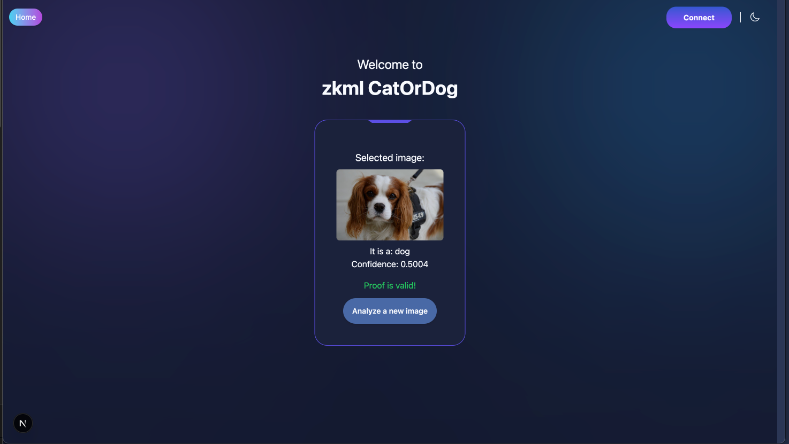
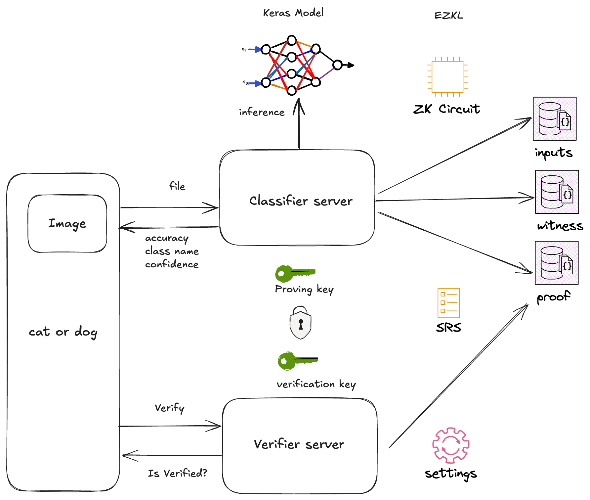
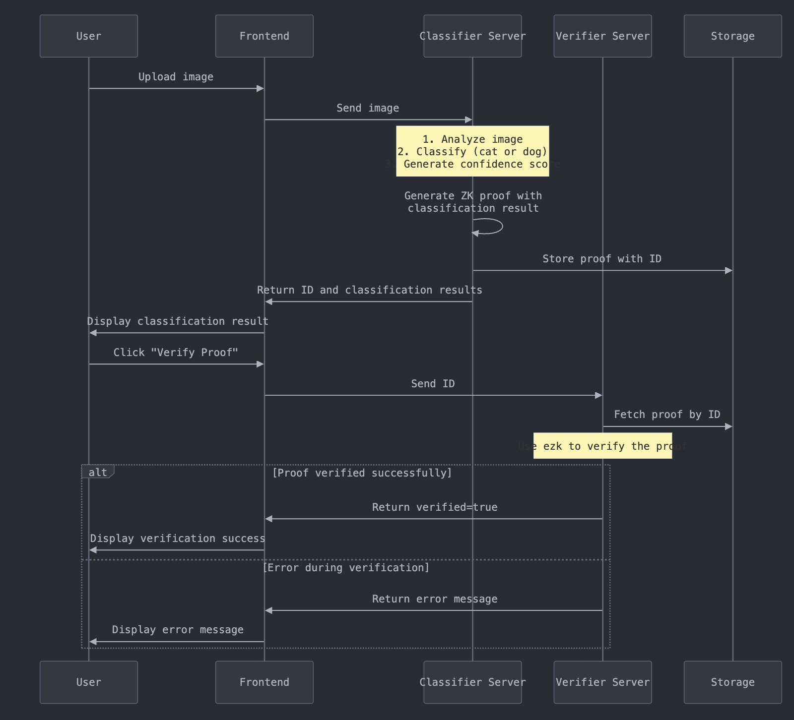

# ZKML Cat or Dog

## Demo

    

## Architecture

    

## Flow 

The following is a flow overview 

1. The user uploads the image.
2. The classifier server analyzes the image, classifies it, and generates the class name (cat or dog) and the confidence level.
3. Once the classifier server gets a result, it creates a proof with the classification model result.
4. It responds to the frontend with an ID.
5. The user clicks on validate/certify/proof (any name you put in the frontend).
6. The frontend sends the ID generated in step 4.
7. The verifier server gets the ID and finds the proof in the local storage (a simple directory).
8. The verifier server uses ezk to verify the proof if it exists.
9. The verifier server returns the result with the verified flag, or an error message if something happened.

    

## Classifier

### Model Architecture

| Feature | Original Model | Tiny Model | Reduction Factor |
|---------|---------------|------------|------------------|
| Input Shape | (128, 128, 3) | (16, 16, 3) | 64x |
| Model Size | 37.89 MB | 0.03 MB | 1,263x |
| Total Parameters | 3,305,665 | 51 | 64,817x |
| Number of Layers | 14 | 6 | 2.3x |

### Performance Metrics

| Metric | Original Model | Tiny Model | Difference |
|--------|---------------|------------|------------|
| Accuracy | 83.75% | 50.10% | -33.65% |
| Loss | 0.4111 | 0.6931 | +0.282 |
| Inference Time | 6.22 ms | 3.79 ms | 1.64x faster |

### Key Architecture Differences
- **Original Model**: Uses standard convolutional layers with BatchNormalization, ending with a large Dense layer of 3,211,392 parameters
- **Tiny Model**: Uses depthwise separable convolutions and GlobalAveragePooling2D to drastically reduce parameters

### Classification Behavior
- **Original Model**: Balanced performance (802/1000 cats, 873/1000 dogs correctly classified)
- **Tiny Model**: Extreme bias toward "cat" class (1000/1000 cats, only 2/1000 dogs correctly classified)

## EZKL
Trade-offs:
- While the original model achieved 83% accuracy, it cannot complete the setup stage, preventing us from generating the necessary proving and verification components.
- The calibration process works effectively with smaller models but fails to scale properly with larger model architectures.
- EZKL provides valuable functionality but is incompatible with GPU acceleration, requiring CPU-only processing which impacts performance.

## Stack
- ML: Keras
- Backends: FastAPI
- Frontend: scaffold-stark (React + NestJS)
- ZK-ML: ezkl

## Instructions

The following instructions detail the deployment procedures and operational requirements for each service to ensure proper functionality.

- [classifier models](classifier/README.md)
- [classifier Server](backend/classifier/Readme.md)
- [verifier server](backend/verifier/Readme.md)
- [frontend](web3/README.md)

## Team

- [Javier Montes](https://github.com/javiermontescarrera)
- [Chris Cushman](https://github.com/vreff)
- [Cristian Chaparro](https://github.com/cristianchaparroa)
